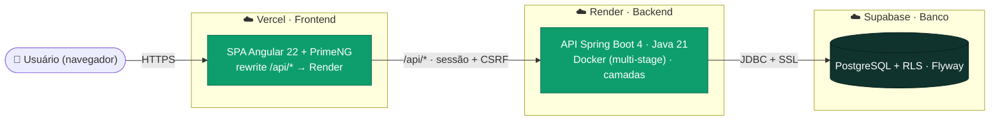

<div align="center">
  

  # + Sustentável

  **Plataforma web de logística reversa de óleo de cozinha usado.**
  Cada litro real coletado vira **R$ 1,00 para ações sociais** — _"cada litro soma"_.
</div>

> Trabalho final da disciplina **FACOM32403 — Processo de Desenvolvimento de Software** (Bacharelado em Sistemas de Informação · UFU · 2026/1).
> Integrante: **William Menezes Damascena** (12521BSI233) — também no papel de **Product Owner**.

---

## 1. Motivação

O óleo de cozinha usado descartado na pia contamina água e solo — um único litro polui milhares de litros de água. Ao mesmo tempo, esse resíduo tem valor: pode ser transformado em biodiesel, sabão e outros produtos. O **+ Sustentável** conecta os dois lados dessa cadeia: organiza os **locais** e **pontos de coleta**, registra os **litros reais** recolhidos e converte essa medição em **valor social** (R$ 1,00 por litro) destinado a causas sociais — dando **transparência** e **incentivo** à logística reversa.

## 2. O que o sistema faz (MVP)

O escopo comprometido (Sprints 1–4) entrega a espinha dorsal da operação, para o papel de **Gestor**:

| História | Funcionalidade |
|----------|----------------|
| **AC-01** | Esqueleto Spring implantado + **autenticação por sessão** e papéis (RBAC) modelados |
| **CA-01** | **Cadastrar locais** (instituições atendidas) com arquivamento (soft delete) |
| **CA-02** | **Cadastrar pontos de coleta** dentro de um local, cada um com **QR Code único** |
| **OP-03** | **Registrar coletas** (litros reais) num ponto, com total acumulado |
| **IS-01** | **Cálculo do valor social** — total, por local e série mensal |
| **IS-02** | **Painel de impacto** consolidado |
| **LP-01** | **Landing page** pública (hero + modelo) |

Os quatro papéis do domínio (**Gestor, Responsável, Coletor, Doador**) já ficam **modelados** no banco (N:N); no MVP apenas o **Gestor** é ativo — os demais evoluem no backlog (gamificação, doação via QR, ranking etc.).

## 3. Conceitos de domínio

- **Dois trilhos de medição:** _doação declarada_ (base futura da gamificação) e **litros reais coletados** (base do **valor social** e da reconciliação) — grandezas distintas que nunca se confundem.
- **Valor social = R$ 1,00 × litros reais**, **sempre** sobre a medição real, nunca sobre o declarado.
- **Local 1:N Ponto**; cada ponto tem um **QR Code único** (conteúdo = URL do app).
- **Soft delete** (Local, Ponto): sai das listas ativas mas **preserva histórico e valor social gerado**.
- Toda quantidade em **litros**; todos os textos em **português do Brasil**.

## 4. Arquitetura

Três camadas desacopladas, hospedadas de forma independente e comunicando por HTTPS:



Diagramas completos (arquitetura, componentes/módulos e gitflow) na **[Wiki](https://github.com/william-menezes/mais-sustentavel/wiki)**.

## 5. Stack

| Camada | Tecnologia | Deploy |
|--------|------------|--------|
| **Backend** | Java 21 · Spring Boot 4 · Spring Security 7 · Spring Data JPA · Flyway · ZXing (QR) | Docker → **Render** |
| **Frontend** | Angular 22 (standalone + signals) · PrimeNG | **Vercel** |
| **Banco** | PostgreSQL com **RLS** | **Supabase** |
| **Testes** | JUnit 5 + **Testcontainers** (backend) · **Vitest** (frontend) | GitHub Actions |
| **Processo** | **Spec-Driven Development** (GitHub Spec Kit) + **TDD** + **Scrum** | — |

> **Java vive apenas no Docker** — não é preciso JDK no host (ver `constitution.md`, Art. 1.6).

## 6. Estrutura do monorepo

```
api/                 API Spring Boot — módulos por domínio (camadas web→service→repository→domain):
    auth  local  ponto  coleta  impacto  config
frontend/            SPA Angular — core/ (transversal), domain/ (features),
                     shared/ e widget/ (componentes reutilizáveis)
infra/               docker-compose (Postgres + API) para desenvolvimento local
docs/                design system, backlog/histórias, workflow e páginas da wiki (docs/wiki/)
.specify/            Spec Kit — constituição canônica e templates
.github/workflows/   CI (GitHub Actions): jobs Backend (API) e Frontend (Web)
```

## 7. Começando

**Pré-requisitos:** Docker Desktop e Node 20+ (para o frontend). JDK **não** é necessário no host.

### Backend + banco (Docker)

```bash
docker compose -f infra/docker-compose.yml up --build
# Health: http://localhost:8080/actuator/health
```

### Frontend

```bash
cd frontend
npm ci
npm start                 # http://localhost:4200
npm test -- --watch=false # testes unitários (Vitest)
npm run build             # build de produção
```

## 8. Testes e qualidade (TDD)

**TDD é inegociável** (Art. 5): nenhum código de produção antes do teste que o cobre; ciclo **Red → Green → Refactor**.

- **Backend:** JUnit 5 + **Testcontainers** (PostgreSQL real), executados **no Docker** — cobre repositórios, serviços e controllers (incluindo cenários de segurança 401/403 e validação).
- **Frontend:** **Vitest** (`*.spec.ts`) para serviços e componentes.
- **CI (GitHub Actions):** todo `push`/PR para `develop`/`homolog`/`main` roda os dois jobs; **nada é mesclado com teste falhando**. O job de backend ainda valida o `docker build` da imagem de produção.

## 9. Processo de desenvolvimento

O desenvolvimento é **Spec-Driven (SDD)** com o **[GitHub Spec Kit](https://github.com/github/spec-kit)**, combinado a **Scrum** (4 sprints) e **TDD**. Para cada história: `Constitution → /speckit-specify → /speckit-clarify → /speckit-plan → /speckit-tasks → /speckit-analyze → /speckit-implement`. Os artefatos ficam versionados em `specs/NNN-slug/`.

**Branches** — promoção sempre por Pull Request com CI verde:

```
feature/NNN-slug ──▶ develop ──▶ homolog ──▶ main (produção)
```

Detalhes em [`docs/workflow.md`](docs/workflow.md) e na página **[Gitflow](https://github.com/william-menezes/mais-sustentavel/wiki/Gitflow)** da wiki.

## 10. Segurança (baseline — Art. 7)

Autenticação por **sessão** (cookie `HttpOnly`); **CSRF** _double-submit_ (padrão SPA do Spring Security 7); **CORS** restrito; **RLS** no Supabase; validação de entrada e consultas parametrizadas; mensagens de erro genéricas (sem enumeração de usuários); segredos apenas em variáveis de ambiente.

## 11. Documentação

- **Constituição (regras inegociáveis):** [`.specify/memory/constitution.md`](.specify/memory/constitution.md)
- **Fluxo de trabalho:** [`docs/workflow.md`](docs/workflow.md)
- **Design system:** [`docs/design.md`](docs/design.md)
- **Backlog / histórias:** [`docs/especificacao-detalhada-specs-sustentavel.md`](docs/especificacao-detalhada-specs-sustentavel.md)
- **Wiki (relatório + diagramas):** https://github.com/william-menezes/mais-sustentavel/wiki
