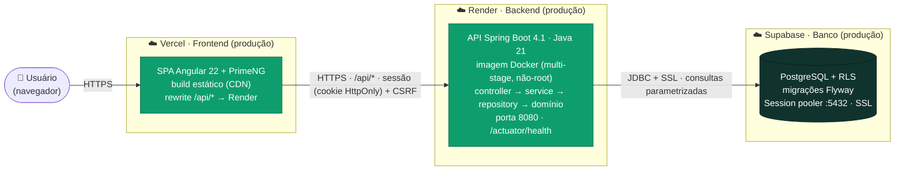
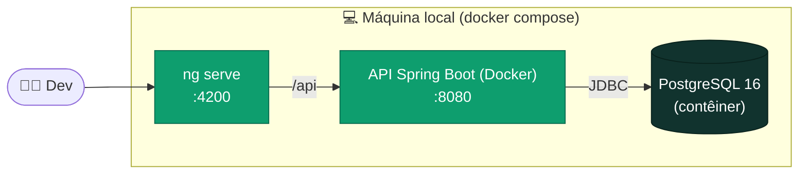

# Projeto Arquitetural

O **+ Sustentável** adota uma arquitetura **web desacoplada em três camadas hospedadas de forma independente**: um _frontend_ (SPA) na **Vercel**, um _backend_ (API REST orientada a objetos) na **Render** e um **banco de dados** gerenciado no **Supabase**. Cada camada é implantada, escalada e versionada separadamente; a comunicação entre elas é sempre por **HTTPS**.

## Diagrama de arquitetura (implantação)

## Camadas e hospedagem

| Camada | Tecnologia | Onde é hospedado | Observações |
|--------|-----------|------------------|-------------|
| **Frontend** | Angular 22 + PrimeNG (SPA, _standalone_ + _signals_) | **Vercel** | Build estático distribuído por CDN. Um `rewrite` no `vercel.json` encaminha `/api/*` para a API na Render — assim o navegador conversa com o backend na **mesma origem**, simplificando cookies de sessão e CSRF. |
| **Backend** | Spring Boot 4.1 · Java 21 (arquitetura em camadas) | **Render** | Publicado como **imagem Docker** (Dockerfile _multi-stage_, usuário não-root). Host público `mais-sustentavel.onrender.com`, _health check_ em `/actuator/health`, **deploy automático** a partir da branch `main`. |
| **Banco de dados** | PostgreSQL + **RLS** | **Supabase** | Acesso via _Session pooler_ (porta 5432, `sslmode=require`). Esquema versionado com **Flyway**. Segredos de conexão apenas em variáveis de ambiente (nunca no repositório). |

## Organização do backend (camadas e módulos)

A API segue estritamente `controller → service → repository → domínio` (a regra de negócio vive no _service_/domínio, nunca no _controller_). O código é organizado por **módulos de domínio**:

- `auth` — autenticação por sessão, papéis (RBAC), _seed_ do Gestor inicial;
- `local` — cadastro de locais (soft delete);
- `ponto` — pontos de coleta e geração de **QR Code** (ZXing);
- `coleta` — registro de litros reais por ponto;
- `impacto` — agregação do **valor social** (total, por local, série mensal);
- `config` — segurança (Spring Security 7): CSRF _double-submit_, CORS, filtros.

## Segurança na arquitetura (Art. 7)

- **Autenticação por sessão**: cookie `JSESSIONID` `HttpOnly`; endpoints sob `/api/**` exigem sessão (401 sem sessão).
- **CSRF**: padrão SPA do Spring Security 7 (cookie `XSRF-TOKEN` + header `X-XSRF-TOKEN`, _double-submit_) nas escritas.
- **CORS** restrito às origens conhecidas; **HTTPS** ponta a ponta.
- **RLS** (Row-Level Security) habilitada nas tabelas no Supabase — o isolamento de dados não depende apenas da aplicação.
- **Segredos** (banco, credenciais do Gestor) somente em variáveis de ambiente (`sync:false` no blueprint da Render).

## Ambiente de desenvolvimento local

Em desenvolvimento, a mesma API roda em contêiner via `docker compose` (Art. 1.6 — Java vive só no Docker) contra um **PostgreSQL local**, e o frontend roda com `ng serve` (`http://localhost:4200`). Homologação e produção usam o **Supabase**.

