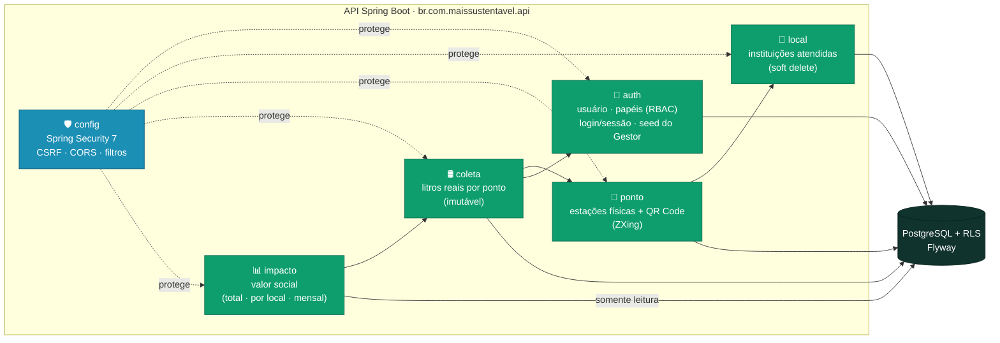
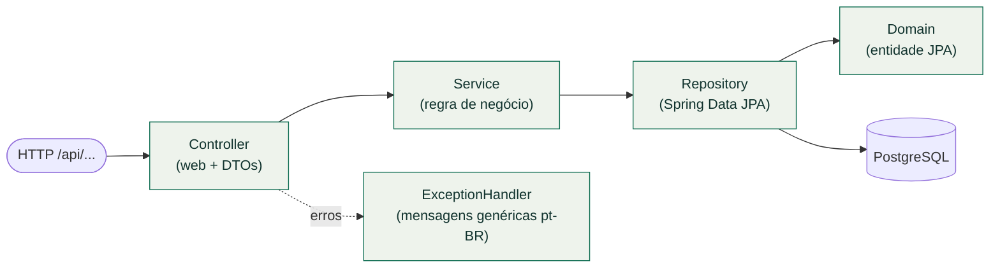
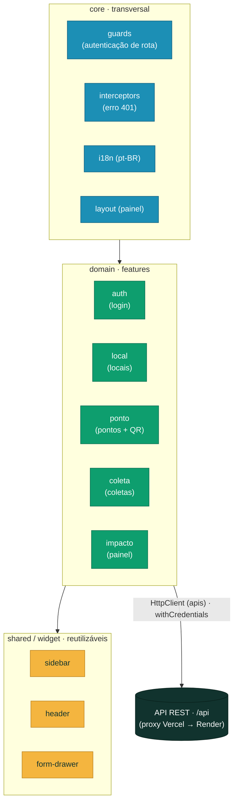

# Projeto de Componentes (Módulos)

O sistema é dividido em dois artefatos implantáveis — **API** (backend) e **SPA** (frontend) — cada um organizado em **módulos coesos**. O backend agrupa por **domínio**, com camadas internas `web → service → repository → domínio`; o frontend agrupa por **feature** (`domain/`) sobre uma base transversal (`core/`) e componentes reutilizáveis (`shared/`, `widget/`).

## Backend — módulos de domínio e dependências

Cada módulo do backend (`br.com.maissustentavel.api.<módulo>`) é autocontido e expõe seus endpoints REST. As dependências entre módulos seguem as regras do domínio (um ponto pertence a um local; uma coleta pertence a um ponto e registra um coletor; o impacto agrega coletas). O módulo `config` (Spring Security) é **transversal**.

| Módulo | Responsabilidade | Destaques |
|--------|------------------|-----------|
| **auth** | Autenticação por sessão, papéis (RBAC N:N), _seed_ do Gestor | Spring Security, BCrypt, anti-enumeração, rate limit de login |
| **local** | Cadastro de locais (instituições) | Soft delete (RN-G-06) |
| **ponto** | Pontos de coleta e **QR Code** único por ponto | Geração do QR com ZXing; QR = URL do app |
| **coleta** | Registro de litros reais medidos num ponto | Registro **imutável** (append-only) |
| **impacto** | Agregação do **valor social** (R$ 1,00 × litro) | Somente leitura; total, por local e série mensal |
| **config** | Segurança transversal | CSRF _double-submit_, CORS restrito |

## Backend — camadas internas de um módulo

Todos os módulos seguem a mesma arquitetura em camadas (Art. 1): a regra de negócio vive no **service**/domínio, nunca no controller.

## Frontend — módulos da SPA

O frontend (Angular 22 _standalone_ + _signals_) separa **features de domínio** (`domain/`), **infraestrutura transversal** (`core/`) e **componentes reutilizáveis** (`shared/`, `widget/`). Cada feature tem `pages`, `components`, `interfaces` e `apis` (serviços que falam com a API).

| Camada | Papel |
|--------|-------|
| **core** | _Guards_ de rota, _interceptor_ de erro de autenticação, i18n (pt-BR), _layout_ do painel, página inicial |
| **domain** | Uma pasta por _feature_ (`auth`, `local`, `ponto`, `coleta`, `impacto`), cada uma com `pages`, `components`, `interfaces` e `apis` |
| **shared / widget** | Componentes reutilizáveis entre features — **sidebar**, **header**, **form-drawer** e afins |

> **Correspondência back ↔ front:** cada _feature_ do frontend consome os endpoints do módulo homônimo do backend (ex.: `domain/coleta` → `POST/GET /api/pontos/{id}/coletas`; `domain/impacto` → `GET /api/impacto/valor-social`).
