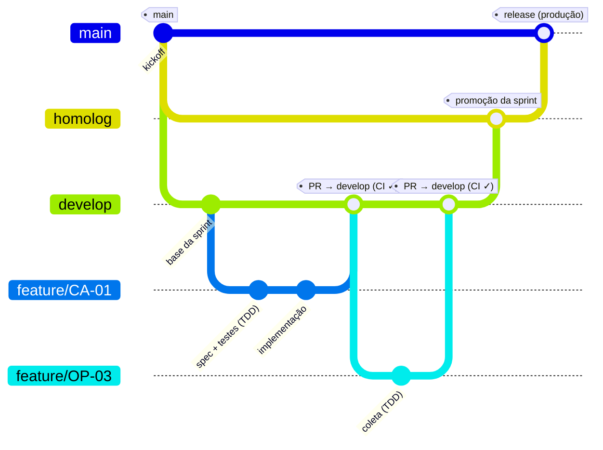
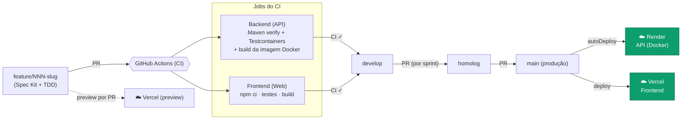

# Fluxo de Versionamento (Gitflow) e DevOps

O projeto usa um **Gitflow de três branches permanentes** — `develop` → `homolog` → `main` — com **branches de feature** para cada história. Toda integração acontece por **Pull Request com CI verde**; nada é mesclado com teste falhando. A promoção até produção é feita **em lote, ao fim de cada sprint**.

A metodologia de desenvolvimento é **Spec-Driven Development (SDD)** com o **[GitHub Spec Kit](https://github.com/github/spec-kit)**, combinada a **Scrum** (4 sprints) e a **TDD** — detalhada na seção [Metodologia](#metodologia-sdd-com-github-spec-kit) abaixo.

## Diagrama do Gitflow



## Metodologia: SDD com GitHub Spec Kit

O desenvolvimento segue **Spec-Driven Development (SDD)** com o **GitHub Spec Kit**: a **intenção é a fonte da verdade** — toda mudança de comportamento começa atualizando a **especificação**, e a implementação decorre dela (o código serve à spec, não o contrário). Para cada história do backlog, executamos o pipeline do Spec Kit, sempre sob **TDD** (Red → Green → Refactor):

```mermaid
flowchart LR
    C["📜 Constitution<br/>(princípios do projeto)"] --> S["/speckit-specify<br/>o quê / por quê<br/>(cria a branch)"]
    S --> CL["/speckit-clarify<br/>(remove ambiguidade)"]
    CL --> P["/speckit-plan<br/>(o como técnico)"]
    P --> T["/speckit-tasks<br/>(tarefas · teste antes)"]
    T --> A["/speckit-analyze<br/>(gate de consistência)"]
    A --> I["/speckit-implement<br/>(TDD: Red→Green→Refactor)"]
    I -->|PR + CI ✓| D["develop"]

    classDef spec fill:#1C8FB5,stroke:#0E5C7D,color:#ffffff;
    classDef impl fill:#0E9E6E,stroke:#0B6B4F,color:#ffffff;
    class S,CL,P,T,A spec;
    class I impl;
```



Cada história é conduzida por esse ciclo antes de qualquer código. Os **artefatos do Spec Kit** ficam versionados em `specs/NNN-slug/` (`spec.md`, `plan.md`, `research.md`, `data-model.md`, `contracts/`, `tasks.md`, `checklists/`), garantindo a rastreabilidade **história (Jira) ↔ feature spec ↔ `tasks.md` ↔ subtarefa (Jira)**. O `/speckit-analyze` funciona como _gate_ de consistência entre spec, plan e tasks antes do `implement`.

## As três branches (Art. 6)

| Branch | Papel | Regras |
|--------|-------|--------|
| **`develop`** | Integração contínua das features | Recebe cada feature por PR (CI verde). Acumula a sprint. |
| **`homolog`** | Homologação | Recebe `develop` por PR após os testes de integração. |
| **`main`** | **Produção** (padrão e protegida) | Recebe `homolog` por PR após homologação. Dispara o deploy. |

- Cada história **nasce de `develop`** em uma **branch de feature** (`feature/…` ou `NNN-slug` criada pelo Spec Kit).
- Promoção **sempre via Pull Request com CI verde**; merge direto pulando etapas é proibido (salvo _hotfix_ documentado).
- **Promoção em lote:** as features acumulam em `develop` durante a sprint; ao final, `develop → homolog → main` é promovido de uma vez.

```text
feature/NNN-slug ──PR──▶ develop ──PR──▶ homolog ──PR──▶ main
     (Spec Kit + TDD)   (integração)   (homologação)   (produção)
```

## Pipeline de CI/CD

Cada `push`/`pull_request` para `develop`, `homolog` ou `main` dispara o **GitHub Actions** (`.github/workflows/ci.yml`), com dois jobs paralelos. A entrega em produção é **contínua**: a Render faz _auto-deploy_ da API a partir da `main` e a Vercel publica o frontend.



## Práticas adotadas

- **TDD como guardião do merge**: o CI roda os testes de backend (JUnit 5 + **Testcontainers** com PostgreSQL real, dentro do Docker) e de frontend (Vitest) — nada entra em `develop` com teste vermelho.
- **Validação da imagem de produção**: o job de backend também executa `docker build` do `Dockerfile` de produção, garantindo que a imagem publicável compila.
- **Preview automático**: cada PR gera um _deploy_ de _preview_ na Vercel, permitindo revisar a UI antes do merge.
- **Deploy contínuo**: ao atualizar a `main`, a Render reconstrói e publica a API automaticamente (`autoDeploy: true`), e a Vercel publica o frontend.
- **Conventional Commits + gitmoji** nas mensagens, para um histórico legível.
